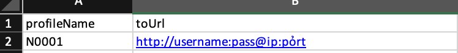
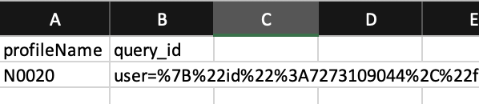

## Hướng dẫn sử dụng

**(Nếu đã có file `Profiles.xlsx` ở các kèo trước thì bỏ qua bước này)**
### 1. Tạo file `Profiles.xlsx` gồm `profileName` và `toUrl` lần lượt là tên profile và proxy định dạng: `http://username:pass@ip:port`, nếu profile nào ko chạy proxy thì để trống.

#### Như hình 


#### Nếu proxy chưa đúng định dạng 
=> Dùng tool convert proxy: https://t.me/W0lfairdrop/235

### 2. Tạo ra file `data.xlsx` (cùng cấp với file này) gồm `profileName` và `query_id` (giá trị có thể là `user_id` hoặc `query_id` hoặc `iframe`) nhưng tên cột phải để là query_id như hình:



!!!
Chú ý tên các cột phải để giống như mô tả **(kể cả chữ hoa chữ thường)** và giá trị `profileName` phải giống với `profileName` của file `Profiles.xlsx` để map với nhau.

### 3. CONFIG: Trong config.json 
```
- "numThreads": sửa thành số luồng muốn chạy
- "doQuest": có làm task hay không true/false,
- "waitTime": thời gian nghỉ giữa mỗi lần (chạy đơn vị giây)
- "maxRetries": số lần thử lại khi gặp lỗi của server, mặc đinh là 3
- "checkAndUpdateProfile" 
👉 mặc định = true để check và update profile nếu thấy còn thiếu.
👉 set = false để bỏ qua check với các bác đã có profile đầy đủ thông số. => Tăng tốc độc chạy
```

### 4. Install: Chạy file `install.bat` hoặc ```npm install```

### 5. Chạy tool Chạy file `start.bat` hoặc ```node index.js```


## Contact
🛒 Mua tools - 🐞Report Bug - 🔓 Request Kèo - 🛫 Liên hệ: JoyDadDev (https://t.me/joydaddev)

## 🎁 Donate


