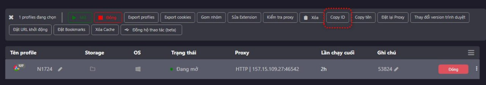
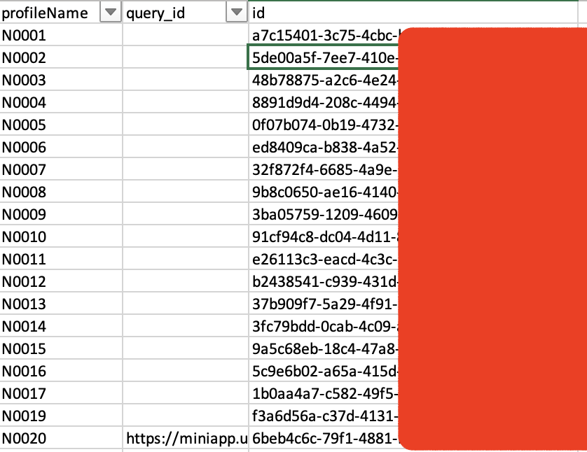

## Hướng dẫn sử dụng lấy iframe trực tiếp

### 🔓 Yêu cầu: máy cài nodejs và GPM login.


### 1. Chuẩn bị Profiles.xlsx
**(Nếu đã có file `Profiles.xlsx` ở các kèo trước thì bỏ qua bước 1)**

#### Tạo file `Profiles.xlsx` gồm `profileName` và `toUrl` lần lượt là tên profile và proxy định dạng: `http://username:pass@ip:port`, nếu profile nào ko chạy proxy thì để trống.

#### Như hình 


#### Nếu proxy chưa đúng định dạng 
=> Dùng tool convert proxy: https://t.me/W0lfairdrop/235

#### File mẫu: [Profiles.xlsx](Profiles.xlsx)

### 2. Chuẩn bị data.xlsx

#### Tạo ra file `data.xlsx` (cùng cấp với file này) gồm:
-  `profileName`
- `id` : lấy từ GPM login. Cách lấy id của profile GPM. Chọn tất cả profile muốn chạy xong nhấn copy Id, paste vào cột id của data.xlsx là được.




- `query_id` (có thể có hoặc không với cách lấy trực tiếp) (giá trị có thể là `user_id` hoặc `query_id` hoặc `iframe`) nhưng tên cột phải để là query_id như hình:



#### File mẫu: [data.xlsx](data.xlsx)

!!!
Chú ý tên các cột phải để giống như mô tả **(kể cả chữ hoa chữ thường)** và giá trị `profileName` phải giống với `profileName` của file `Profiles.xlsx` để map với nhau.

### 3. CONFIG: Trong config.json

  - `autoGetIframe`: true nếu auto lấy if, false nếu muốn lấy thủ công như cũ
  - `GPM_URL`: "http://127.0.0.1:19995", giữ nguyên nếu ko thay đổi gì trong gpm login
  - `LINK_REF`: sửa thành link ref của bạn
  - `numThreads`: nến giảm xuống còn 20-30 để tránh mở nhiều chrome, tránh chạy song song nhiều kèo khác.

### 4. Install: Chạy file `install.bat` hoặc ```npm install```

### 5. Chạy tool Chạy file `start.bat` hoặc ```node index.js```


## Contact
🛒 Mua tools - 🐞Report Bug - 🔓 Request Kèo - 🛫 Liên hệ: JoyDadDev (https://t.me/joydaddev)

## 🎁 Donate
